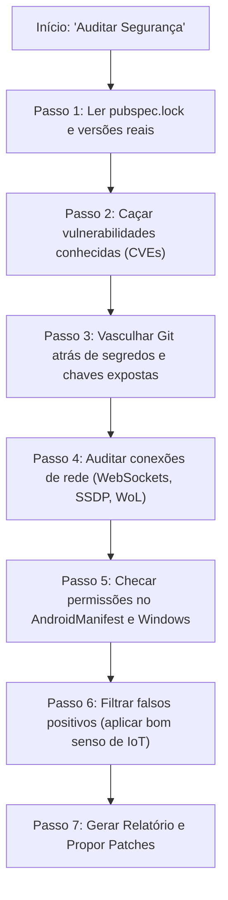

# Guia Descomplicado da Skill de Auditoria de Segurança (SixF)

Fala, desenvolvedor! Este documento foi escrito para explicar, em linguagem direta e sem enrolação, **o que é**, **como funciona** e **como foi pensada a arquitetura** da nossa nova skill de auditoria de segurança (`flutter-security-audit`).

---

## 1. O que é uma "Skill" para a IA?

Pense numa **Skill** como uma "memória de trabalho especializada" ou um manual de instruções rápido que a IA carrega na cabeça quando você pede uma tarefa específica.

Em vez de você ter que lembrar a IA toda vez: *"Olha, lembre-se de que estamos no Flutter, não marque a porta da Samsung como erro, verifique o Git, não mude o código sem minha permissão..."*, a Skill já deixa todas essas regras e checklists mastigados. 

Quando você escreve coisas como:
> *"Faça uma auditoria de segurança no app"*  
> *"O código do SixF tem alguma vulnerabilidade?"*  
> *"/flutter-security-audit"*

A IA percebe o gatilho, abre a pasta `.agents/skills/flutter-security-audit/` e segue o roteiro à risca, como um auditor sênior de segurança ao seu lado.

---

## 2. Por que adaptamos a Skill original?

A skill que você viu no repositório do Sujeito Programador era voltada para **Web Fullstack (React, Next.js, Node, Stripe, Prisma)**. 

Se tentássemos rodar aquilo no SixF às cegas:
1. Ele ia tentar rodar `npm audit` (e nosso projeto é Dart/Flutter, usa `pubspec.yaml`).
2. Ele ia procurar falhas de *Server Actions* e *Injeção de SQL* (e nós não temos banco SQL de servidor nem rotas HTTP externas; nós somos um app de controle remoto).
3. Ele ia entrar em pânico com certas coisas que são **normais em IoT e Smart TVs**, como se comunicar via HTTP comum na porta 8001 da Samsung ou aceitar certificados SSL autoassinados da LG.

Por isso, pegamos os **princípios daquela skill** (o rigor de checar versões reais, não dar falso alarme, buscar segredos no git e só propor código em vez de sair alterando tudo) e traduzimos 100% para o universo do **Flutter & Smart Remote**.

---

## 3. Onde os arquivos moram e o que cada um faz?

A estrutura foi montada na raiz do projeto dentro da pasta padrão de agentes:

```text
c:\Projetos\SixF\
└── .agents/
    └── skills/
        └── flutter-security-audit/
            ├── SKILL.md                 ← O cérebro da skill (o roteiro da IA)
            └── refs/                    ← As "colas" e manuais que a IA lê
                ├── audit-checklist.md   ← Checklist de pontos críticos para checar
                ├── false-positives.md   ← O que NÃO deve ser considerado erro
                └── report-template.md   ← O modelo visual do relatório final
```

### Detalhando os arquivos:

1. **`SKILL.md` (O Guia Mestre):**
   - Tem um cabeçalho que a ferramenta lê para saber **quando** deve ativar a skill.
   - Define a regra de ouro: **nenhum código é alterado automaticamente** — a IA apenas aponta o dedo e sugere o remendo (*patch*), você decide se aplica.
   - Define as 7 etapas do trabalho da IA (do escopo ao relatório).

2. **`refs/audit-checklist.md` (A Lista de Inspeção):**
   - É a lista onde a IA checa item a item:
     - *Os WebSockets tratam dados corrompidos com `try/catch`?*
     - *A busca SSDP fecha o socket ou fica gastando bateria do celular?*
     - *O MAC Address do Wake-on-LAN é validado antes de disparar o pacote mágico?*
     - *Tem certificado `.pem` ou `.key` esquecido dentro do repositório?*

3. **`refs/false-positives.md` (O Filtro de Bom Senso):**
   - Este arquivo é o segredo para não ter um relatório chato e inútil cheio de falsos alarmes.
   - Exemplo clássico: No Android, o `usesCleartextTraffic="true"` costuma ser marcado como "PERIGO CRÍTICO" por scanners genéricos. Mas nós sabemos que a Samsung usa porta HTTP/WS pura (8001) na rede de casa. O arquivo ensina a IA a entender que isso é normal de TV e não sair dando bronca à toa.

4. **`refs/report-template.md` (O Formato do Relatório):**
   - Garante que a resposta saia bonitinha: com notas de gravidade (`CRITICAL`, `HIGH`, `MEDIUM`, `LOW`, `INFO`), trechos de código mostrando o erro e tabelas fáceis de bater o olho.

---

## 4. O Passo a Passo da IA quando ela roda a auditoria

Para você entender exatamente o que acontece nos bastidores quando a skill é executada:



### Conversando sobre cada passo:

- **Passo 1 — Entender as versões reais:** Em vez de olhar apenas o `pubspec.yaml` (que tem aquele chapeuzinho `^` dizendo "versão x ou superior"), a IA vai no `pubspec.lock`, que é onde está gravada a versão **exata** que está instalada na sua máquina hoje.
- **Passo 2 — Caçar problemas nos pacotes:** Ela checa se alguma dependência usada tem histórico de falhas graves de segurança. Se apenas existir uma versão mais nova mas sem falha de segurança, ela não te amola com isso.
- **Passo 3 — Procurar segredos esquecidos:** Ela faz um pente fino no Git. Por exemplo, se alguém gerou um `cert.pem` ou `key.pem` de teste ou colocou um IP/chave fixa de TV direto no código e esqueceu lá, a IA vai avisar: *"Cuidado, isso não deveria subir pro GitHub!"*.
- **Passo 4 — Examinar a rede local (O coração do SixF):**
  - Checa os drivers da LG (`LgWebOsDriver`) e Samsung (`SamsungTizenDriver`).
  - Como a LG usa SSL na porta 3001 com certificado que a própria TV cria, o app tem que aceitar o certificado. A IA vai checar: *ele só aceita isso se o IP for da rede local (ex: 192.168.x.x) ou aceitaria qualquer coisa aberta na internet?*
  - Checa se o pacote mágico de ligar a TV (Wake-on-LAN) valida se o MAC Address está no formato correto antes de mandar o broadcast.
- **Passo 5 — Permissões de Android e Windows:** Olha o `AndroidManifest.xml` para garantir que o app não está pedindo mais permissões do que precisa (ex: localização sem necessidade, câmera, etc.).
- **Passo 6 — Filtro anti-falso-positivo:** Ela relê tudo o que encontrou com base no manual de bom senso para não trazer alertas bobos.
- **Passo 7 — Entrega do relatório:** Ela gera o documento com notas claras e, se encontrar algo sério, mostra o código antigo e sugere o código novo para você aprovar.

---

## 5. Como usar no seu dia a dia?

Você não precisa decorar nenhum comando complexo. Basta pedir no chat com naturalidade:

- *"Dá uma checada geral na segurança do projeto SixF com a skill"*
- *"Roda a auditoria de segurança"*
- *"Tem alguma chave ou vulnerabilidade de rede exposta no código?"*

O assistente vai carregar automaticamente a skill, inspecionar os arquivos e te entregar o diagnóstico mastigado!
